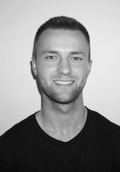

##### Currently on the job market! Looking for a software engineering position (ideally where I get to work close to lots of data).

# About Me

I'm a senior at NYU Abu Dhabi, graduating in May 2019 with a degree in physics and philosophy. I have focused my undergrad on building a variety of skills through research. I'm especially adept at using python (with sklearn, numpy, sciy, pandas, matplotlib) to make sense of large datasets. The bulk of my work has been in astrophysics, but I've also done work in applied machine learning, glaciology, and normative theory. Some of my work in applied machine learning has been accepted for publication, and I'm quite excited to see where my capstone projects, one in galaxy formation and the other at the intersection of ethics and decision theory, end up. Check out my research page for more details on these projects!

# Personal

My time at NYU Abu Dhabi has been an exciting and hectic chapter in my life. Though I've been based in the UAE in this time, I've also lived in Singapore, Berlin, and New York City. Before college, I lived in St. Louis, Missouri. And before that, I grew up in Breese, Illinois, an idyllic little farm town. I miss having a cornfield for a backyard.

